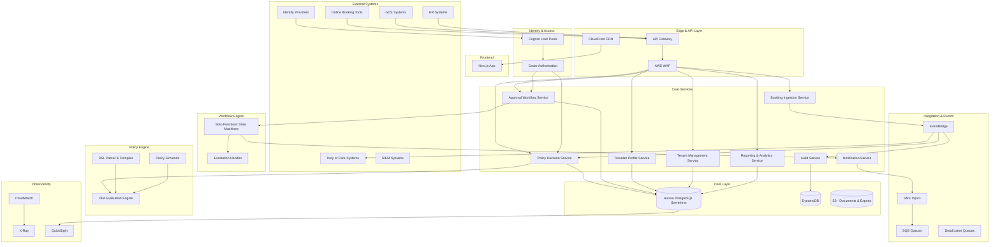
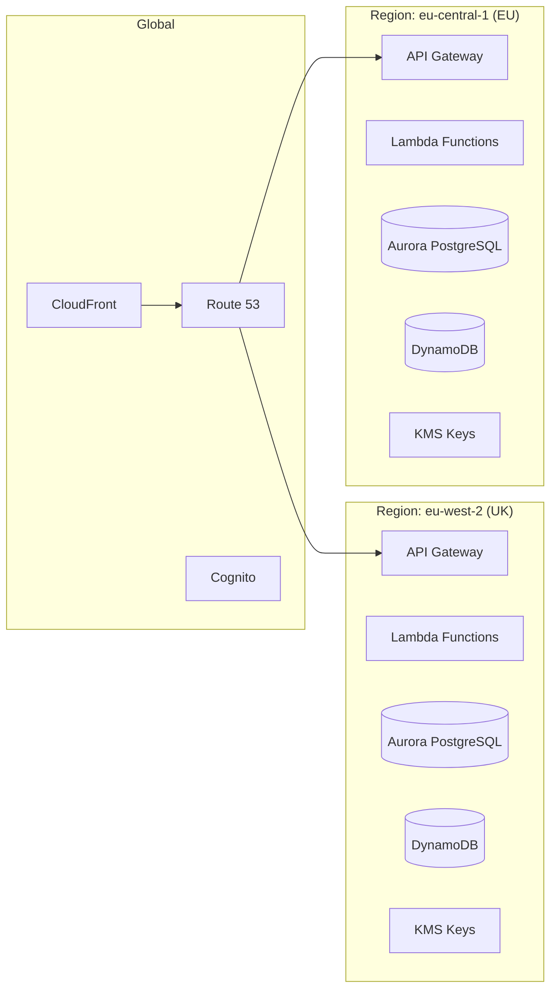

# Design Document: Corporate Travel Policy and Approvals Platform

## Overview

This document defines the technical design for the Corporate Travel Policy and Approvals Platform — a multi-tenant SaaS system that evaluates trip requests against configurable travel policies, orchestrates approval workflows, monitors compliance, and integrates with external booking systems, identity providers, and downstream operational systems.

The platform follows an AWS-native serverless-first architecture, using Lambda for compute, Step Functions for workflow orchestration, EventBridge for event-driven integration, Aurora PostgreSQL Serverless for relational data, DynamoDB for high-throughput operational data, and Cognito for identity federation. The policy engine combines a customer-facing DSL with OPA (Open Policy Agent) for travel policy decisioning, while Cedar handles internal platform authorisation.

### Key Design Decisions

| Decision | Choice | Rationale |
|----------|--------|-----------|
| Policy evaluation engine | OPA (embedded in Lambda) | Stateless evaluation, sub-millisecond decisions, Rego policy bundles, decision logging, and testing support |
| Internal authorisation | Cedar (via cedar-agent or embedded) | Fine-grained RBAC/ABAC, AWS-native, multi-tenant policy isolation |
| DSL parser | PEG grammar (Peggy.js) compiled to TypeScript | Deterministic parsing, good error messages, compiles to OPA-compatible policy graph |
| Multi-tenant data isolation | Schema-per-tenant in Aurora PostgreSQL | Strong isolation, tenant-specific encryption, independent backup/restore, meets compliance requirements |
| Approval orchestration | AWS Step Functions (Standard Workflows) | Long-running human approval tasks via callback tokens, built-in retry/timeout/escalation, visual debugging |
| Event bus | Amazon EventBridge | Native AWS integration, content-based filtering, schema registry, at-least-once delivery |
| API layer | API Gateway REST + Lambda | Versioned endpoints, throttling, WAF integration, OpenAPI generation |
| Frontend | Next.js on CloudFront + S3 | SSR for initial load, static assets on CDN, mobile-first Tailwind UI |

## Architecture

### High-Level System Architecture



### Deployment Architecture

The platform deploys across multiple AWS regions (eu-west-2, eu-central-1, us-east-1, ap-southeast-2) to meet data residency requirements. Each region operates independently with tenant data pinned to the configured region.



## Components and Interfaces

### 1. Tenant Management Service

**Responsibility:** Provisioning, configuration, and lifecycle management of tenants.

**Interface:**
```typescript
interface TenantManagementService {
  // Provision a new tenant with isolated resources
  provisionTenant(request: ProvisionTenantRequest): Promise<Tenant>;
  
  // Update tenant configuration
  updateTenantConfig(tenantId: string, config: TenantConfig): Promise<Tenant>;
  
  // Decommission a tenant (soft delete with data retention)
  decommissionTenant(tenantId: string, reason: string): Promise<void>;
  
  // Get tenant metadata and configuration
  getTenant(tenantId: string): Promise<Tenant>;
  
  // List all tenants with filtering
  listTenants(filter: TenantFilter): Promise<PaginatedResult<Tenant>>;
}

interface ProvisionTenantRequest {
  organisationName: string;
  dataResidencyRegion: 'uk' | 'eu' | 'us' | 'anz';
  adminEmail: string;
  plan: 'standard' | 'enterprise';
  identityProviderConfig?: IdentityProviderConfig;
  encryptionConfig?: EncryptionConfig;
}

interface Tenant {
  tenantId: string;
  organisationName: string;
  dataResidencyRegion: string;
  status: 'provisioning' | 'active' | 'suspended' | 'decommissioned';
  schemaName: string;
  kmsKeyArn: string;
  cognitoUserPoolId: string;
  createdAt: string;
  config: TenantConfig;
}
```

### 2. Policy Decision Service

**Responsibility:** Evaluating trip requests against tenant-configured policy rules using OPA.

**Interface:**
```typescript
interface PolicyDecisionService {
  // Evaluate a trip request against policy rules (synchronous, <200ms p95)
  evaluatePolicy(request: PolicyDecisionRequest): Promise<PolicyDecision>;
  
  // Batch evaluate multiple offers
  evaluateBatch(request: BatchPolicyRequest): Promise<BatchPolicyDecision>;
}

interface PolicyDecisionRequest {
  tenantId: string;
  decisionPoint: string;
  traveller: TravellerContext;
  trip: TripContext;
  offers: Offer[];
  metadata?: Record<string, unknown>;
}

interface TravellerContext {
  travellerId: string;
  employeeId: string;
  department: string;
  costCentre: string;
  seniorityLevel: string;
  region: string;
  loyaltyTiers?: Record<string, string>;
}

interface TripContext {
  tripId: string;
  tripType: 'domestic' | 'international' | 'multi-city';
  origin: Location;
  destination: Location;
  departureDate: string;
  returnDate?: string;
  leadTimeDays: number;
  purpose?: string;
}

interface Offer {
  offerId: string;
  supplier: string;
  productType: 'air' | 'hotel' | 'car' | 'rail';
  cabinClass?: string;
  totalPrice: Money;
  carbonFootprintKg?: number;
  refundable: boolean;
  segments?: Segment[];
}

interface PolicyDecision {
  decisionId: string;
  tenantId: string;
  result: 'approve' | 'reject' | 'review';
  winningRules: WinningRule[];
  reasons: string[];
  obligations: Obligation[];
  alternatives: AlternativeSuggestion[];
  budgetStatus?: BudgetStatus;
  carbonImpact?: CarbonImpact;
  expiresAt: string;
  evaluatedAt: string;
  durationMs: number;
}

interface Obligation {
  type: 'require_approval' | 'require_justification' | 'manager_approval' | 'finance_approval';
  description: string;
  metadata?: Record<string, unknown>;
}
```

### 3. Policy Configuration Service

**Responsibility:** Managing policy rules, DSL compilation, versioning, and simulation.

**Interface:**
```typescript
interface PolicyConfigurationService {
  // Parse and compile DSL into policy graph
  compileDSL(tenantId: string, dslSource: string): Promise<CompilationResult>;
  
  // Pretty-print policy graph back to DSL
  prettyPrint(tenantId: string, policyGraphId: string): Promise<string>;
  
  // Save a policy rule (validates before activation)
  saveRule(tenantId: string, rule: PolicyRuleInput): Promise<PolicyRule>;
  
  // Activate a policy version
  activateVersion(tenantId: string, versionId: string): Promise<void>;
  
  // List policy rule versions
  listVersions(tenantId: string, ruleId: string): Promise<PolicyRuleVersion[]>;
  
  // Rollback to a previous version
  rollbackVersion(tenantId: string, ruleId: string, versionId: string): Promise<void>;
  
  // Run policy simulation
  runSimulation(tenantId: string, request: SimulationRequest): Promise<SimulationReport>;
}

interface CompilationResult {
  success: boolean;
  policyGraph?: PolicyGraph;
  errors?: DSLError[];
  warnings?: DSLWarning[];
}

interface DSLError {
  type: 'syntax' | 'semantic';
  message: string;
  line: number;
  column: number;
  expected?: string[];
}

interface SimulationRequest {
  draftRules: PolicyRule[];
  historicalTripIds?: string[];
  dateRange?: DateRange;
  sampleSize?: number;
}

interface SimulationReport {
  simulationId: string;
  totalTripsEvaluated: number;
  tripsAffected: number;
  approvalRateChange: number;
  rejectionRateChange: number;
  estimatedCostImpact: Money;
  changedOutcomes: ChangedOutcome[];
  completedAt: string;
}
```

### 4. Approval Workflow Service

**Responsibility:** Orchestrating approval workflows using Step Functions with escalation, delegation, and SLA management.

**Interface:**
```typescript
interface ApprovalWorkflowService {
  // Initiate an approval workflow from a policy decision
  initiateWorkflow(request: InitiateApprovalRequest): Promise<ApprovalWorkflow>;
  
  // Submit an approval action (approve/reject/request-info)
  submitAction(request: ApprovalActionRequest): Promise<ApprovalWorkflow>;
  
  // Configure workflow templates per tenant
  configureTemplate(tenantId: string, template: WorkflowTemplate): Promise<WorkflowTemplate>;
  
  // Set up delegation for an approver
  configureDelegation(request: DelegationRequest): Promise<Delegation>;
  
  // Get workflow status
  getWorkflow(workflowId: string): Promise<ApprovalWorkflow>;
  
  // List pending approvals for a user
  listPendingApprovals(approverId: string, filter?: ApprovalFilter): Promise<PaginatedResult<ApprovalTask>>;
}

interface InitiateApprovalRequest {
  tenantId: string;
  decisionId: string;
  tripRequestId: string;
  travellerId: string;
  obligations: Obligation[];
  workflowTemplateId: string;
  priority: 'normal' | 'urgent';
}

interface ApprovalWorkflow {
  workflowId: string;
  tenantId: string;
  status: 'pending' | 'approved' | 'rejected' | 'escalated' | 'expired' | 'cancelled';
  currentStage: number;
  stages: ApprovalStage[];
  initiatedAt: string;
  completedAt?: string;
  stepFunctionExecutionArn: string;
}

interface ApprovalStage {
  stageNumber: number;
  type: 'single' | 'parallel' | 'conditional';
  approvers: ApproverAssignment[];
  status: 'pending' | 'approved' | 'rejected' | 'skipped';
  slaDeadline: string;
  escalationTarget?: string;
}

interface WorkflowTemplate {
  templateId: string;
  tenantId: string;
  name: string;
  stages: StageDefinition[];
  escalationRules: EscalationRule[];
  autoApprovalConditions?: AutoApprovalCondition[];
  slaConfig: SLAConfig;
}
```

### 5. Booking Ingestion Service

**Responsibility:** Receiving, validating, deduplicating, and processing webhook events from external booking systems.

**Interface:**
```typescript
interface BookingIngestionService {
  // Receive and acknowledge a webhook event
  receiveWebhook(request: WebhookRequest): Promise<WebhookAcknowledgement>;
  
  // Configure an integration source
  configureIntegration(tenantId: string, config: IntegrationConfig): Promise<Integration>;
  
  // Test integration connectivity
  testIntegration(integrationId: string): Promise<IntegrationTestResult>;
  
  // Get integration health metrics
  getIntegrationHealth(integrationId: string): Promise<IntegrationHealth>;
}

interface WebhookRequest {
  integrationId: string;
  signature: string;
  timestamp: string;
  idempotencyKey: string;
  payload: unknown;
}

interface IntegrationConfig {
  tenantId: string;
  sourceType: 'obt' | 'gds' | 'tmc';
  sourceName: string;
  authConfig: WebhookAuthConfig;
  payloadMapping: PayloadMappingConfig;
  retryPolicy: RetryPolicy;
}
```

### 6. Notification Service

**Responsibility:** Multi-channel notification delivery including email with actionable approval links.

**Interface:**
```typescript
interface NotificationService {
  // Send an approval notification with action links
  sendApprovalNotification(request: ApprovalNotificationRequest): Promise<void>;
  
  // Send a generic notification
  sendNotification(request: NotificationRequest): Promise<void>;
  
  // Validate and process an email-based approval action
  processEmailAction(request: EmailActionRequest): Promise<ApprovalActionResult>;
  
  // Configure notification preferences
  configurePreferences(userId: string, prefs: NotificationPreferences): Promise<void>;
}

interface ApprovalNotificationRequest {
  approverId: string;
  workflowId: string;
  tripSummary: TripSummary;
  actionLinks: ActionLink[];
  expiresAt: string;
  reminderSchedule?: string[];
}

interface ActionLink {
  action: 'approve' | 'reject' | 'request_info';
  url: string;
  token: string;
  expiresAt: string;
}
```

### 7. Audit Service

**Responsibility:** Immutable, tamper-evident audit logging with cryptographic integrity.

**Interface:**
```typescript
interface AuditService {
  // Record an audit event
  recordEvent(event: AuditEvent): Promise<void>;
  
  // Query audit logs
  queryLogs(query: AuditQuery): Promise<PaginatedResult<AuditEntry>>;
  
  // Export audit logs
  exportLogs(request: AuditExportRequest): Promise<ExportJob>;
  
  // Verify integrity of audit chain
  verifyIntegrity(tenantId: string, dateRange: DateRange): Promise<IntegrityReport>;
}

interface AuditEvent {
  tenantId: string;
  userId: string;
  actionType: AuditActionType;
  resourceType: string;
  resourceId: string;
  outcome: 'success' | 'failure' | 'denied';
  sourceIp: string;
  correlationId: string;
  metadata?: Record<string, unknown>;
}

type AuditActionType = 
  | 'policy_decision'
  | 'approval_action'
  | 'config_change'
  | 'authentication'
  | 'data_access'
  | 'user_provisioning'
  | 'policy_override'
  | 'data_export';
```

### 8. Reporting & Analytics Service

**Responsibility:** Financial reporting, carbon reporting, compliance analytics, and approval performance metrics.

**Interface:**
```typescript
interface ReportingService {
  // Generate a spend report
  generateSpendReport(request: SpendReportRequest): Promise<Report>;
  
  // Generate a carbon report
  generateCarbonReport(request: CarbonReportRequest): Promise<Report>;
  
  // Get compliance metrics
  getComplianceMetrics(tenantId: string, filter: MetricsFilter): Promise<ComplianceMetrics>;
  
  // Get approval analytics
  getApprovalAnalytics(tenantId: string, filter: MetricsFilter): Promise<ApprovalAnalytics>;
  
  // Get budget utilisation
  getBudgetUtilisation(tenantId: string, budgetId: string): Promise<BudgetUtilisation>;
  
  // Schedule recurring report
  scheduleReport(request: ScheduleReportRequest): Promise<ReportSchedule>;
}
```

### 9. Traveller Profile Service

**Responsibility:** Managing traveller profiles, preferences, loyalty programmes, and organisational attributes.

**Interface:**
```typescript
interface TravellerProfileService {
  // Get traveller profile
  getProfile(tenantId: string, travellerId: string): Promise<TravellerProfile>;
  
  // Update profile (respects field-level access control)
  updateProfile(tenantId: string, travellerId: string, updates: ProfileUpdate): Promise<TravellerProfile>;
  
  // Sync from HR/SCIM event
  syncFromSCIM(event: SCIMEvent): Promise<SyncResult>;
  
  // Bulk sync organisational data
  bulkSync(tenantId: string, data: BulkSyncPayload): Promise<BulkSyncResult>;
  
  // Handle data subject access request
  exportPersonalData(tenantId: string, travellerId: string): Promise<DataExport>;
  
  // Handle data erasure request
  erasePersonalData(tenantId: string, travellerId: string): Promise<ErasureResult>;
}
```


## Data Models

### Aurora PostgreSQL — Schema-per-Tenant

Each tenant gets a dedicated PostgreSQL schema within a shared Aurora Serverless v2 cluster. All tenant data is encrypted with tenant-specific KMS keys via Aurora's integration with AWS KMS.

#### Tenant Registry (shared `platform` schema)

```sql
-- platform.tenants: Global tenant registry (shared schema)
CREATE TABLE platform.tenants (
    tenant_id UUID PRIMARY KEY DEFAULT gen_random_uuid(),
    organisation_name VARCHAR(255) NOT NULL,
    data_residency_region VARCHAR(10) NOT NULL CHECK (data_residency_region IN ('uk', 'eu', 'us', 'anz')),
    status VARCHAR(20) NOT NULL DEFAULT 'provisioning',
    schema_name VARCHAR(63) NOT NULL UNIQUE,
    kms_key_arn VARCHAR(512) NOT NULL,
    cognito_user_pool_id VARCHAR(255),
    plan VARCHAR(20) NOT NULL DEFAULT 'standard',
    config JSONB NOT NULL DEFAULT '{}',
    created_at TIMESTAMPTZ NOT NULL DEFAULT NOW(),
    updated_at TIMESTAMPTZ NOT NULL DEFAULT NOW(),
    decommissioned_at TIMESTAMPTZ
);
```

#### Per-Tenant Schema Tables

```sql
-- {tenant_schema}.traveller_profiles
CREATE TABLE traveller_profiles (
    traveller_id UUID PRIMARY KEY DEFAULT gen_random_uuid(),
    employee_id VARCHAR(100) NOT NULL UNIQUE,
    email VARCHAR(255) NOT NULL,
    full_name VARCHAR(255) NOT NULL,
    department VARCHAR(100),
    cost_centre VARCHAR(50),
    seniority_level VARCHAR(50),
    region VARCHAR(50),
    manager_id UUID REFERENCES traveller_profiles(traveller_id),
    preferences JSONB DEFAULT '{}',
    loyalty_programmes JSONB DEFAULT '[]',
    passport_details_encrypted BYTEA,
    emergency_contact_encrypted BYTEA,
    status VARCHAR(20) NOT NULL DEFAULT 'active',
    created_at TIMESTAMPTZ NOT NULL DEFAULT NOW(),
    updated_at TIMESTAMPTZ NOT NULL DEFAULT NOW()
);

-- {tenant_schema}.policy_rules
CREATE TABLE policy_rules (
    rule_id UUID PRIMARY KEY DEFAULT gen_random_uuid(),
    name VARCHAR(255) NOT NULL,
    description TEXT,
    dsl_source TEXT NOT NULL,
    policy_graph JSONB NOT NULL,
    opa_bundle_ref VARCHAR(512),
    priority INTEGER NOT NULL DEFAULT 100,
    status VARCHAR(20) NOT NULL DEFAULT 'draft',
    conditions JSONB NOT NULL,
    outcomes JSONB NOT NULL,
    version INTEGER NOT NULL DEFAULT 1,
    effective_from TIMESTAMPTZ,
    effective_to TIMESTAMPTZ,
    created_by UUID NOT NULL,
    created_at TIMESTAMPTZ NOT NULL DEFAULT NOW(),
    updated_at TIMESTAMPTZ NOT NULL DEFAULT NOW()
);

-- {tenant_schema}.policy_rule_versions (version history)
CREATE TABLE policy_rule_versions (
    version_id UUID PRIMARY KEY DEFAULT gen_random_uuid(),
    rule_id UUID NOT NULL REFERENCES policy_rules(rule_id),
    version INTEGER NOT NULL,
    dsl_source TEXT NOT NULL,
    policy_graph JSONB NOT NULL,
    change_description TEXT,
    changed_by UUID NOT NULL,
    created_at TIMESTAMPTZ NOT NULL DEFAULT NOW(),
    UNIQUE(rule_id, version)
);

-- {tenant_schema}.policy_decisions
CREATE TABLE policy_decisions (
    decision_id UUID PRIMARY KEY DEFAULT gen_random_uuid(),
    trip_id UUID,
    decision_point VARCHAR(100) NOT NULL,
    traveller_id UUID NOT NULL REFERENCES traveller_profiles(traveller_id),
    request_payload JSONB NOT NULL,
    result VARCHAR(20) NOT NULL CHECK (result IN ('approve', 'reject', 'review')),
    winning_rules JSONB NOT NULL DEFAULT '[]',
    reasons JSONB NOT NULL DEFAULT '[]',
    obligations JSONB NOT NULL DEFAULT '[]',
    alternatives JSONB DEFAULT '[]',
    budget_status JSONB,
    carbon_impact JSONB,
    duration_ms INTEGER NOT NULL,
    expires_at TIMESTAMPTZ NOT NULL,
    evaluated_at TIMESTAMPTZ NOT NULL DEFAULT NOW()
);

CREATE INDEX idx_decisions_trip ON policy_decisions(trip_id);
CREATE INDEX idx_decisions_traveller ON policy_decisions(traveller_id);
CREATE INDEX idx_decisions_evaluated ON policy_decisions(evaluated_at);

-- {tenant_schema}.approval_workflows
CREATE TABLE approval_workflows (
    workflow_id UUID PRIMARY KEY DEFAULT gen_random_uuid(),
    decision_id UUID NOT NULL REFERENCES policy_decisions(decision_id),
    trip_request_id UUID,
    traveller_id UUID NOT NULL REFERENCES traveller_profiles(traveller_id),
    template_id UUID NOT NULL,
    status VARCHAR(20) NOT NULL DEFAULT 'pending',
    current_stage INTEGER NOT NULL DEFAULT 1,
    stages JSONB NOT NULL,
    step_function_execution_arn VARCHAR(512),
    priority VARCHAR(10) NOT NULL DEFAULT 'normal',
    initiated_at TIMESTAMPTZ NOT NULL DEFAULT NOW(),
    completed_at TIMESTAMPTZ,
    sla_deadline TIMESTAMPTZ NOT NULL
);

CREATE INDEX idx_workflows_status ON approval_workflows(status);
CREATE INDEX idx_workflows_traveller ON approval_workflows(traveller_id);

-- {tenant_schema}.approval_actions
CREATE TABLE approval_actions (
    action_id UUID PRIMARY KEY DEFAULT gen_random_uuid(),
    workflow_id UUID NOT NULL REFERENCES approval_workflows(workflow_id),
    stage_number INTEGER NOT NULL,
    approver_id UUID NOT NULL REFERENCES traveller_profiles(traveller_id),
    action VARCHAR(20) NOT NULL CHECK (action IN ('approve', 'reject', 'request_info', 'delegate', 'escalate')),
    comment TEXT,
    source VARCHAR(20) NOT NULL DEFAULT 'ui' CHECK (source IN ('ui', 'email', 'api', 'auto')),
    acted_at TIMESTAMPTZ NOT NULL DEFAULT NOW()
);

-- {tenant_schema}.workflow_templates
CREATE TABLE workflow_templates (
    template_id UUID PRIMARY KEY DEFAULT gen_random_uuid(),
    name VARCHAR(255) NOT NULL,
    description TEXT,
    stages JSONB NOT NULL,
    escalation_rules JSONB NOT NULL DEFAULT '[]',
    auto_approval_conditions JSONB DEFAULT '[]',
    sla_config JSONB NOT NULL,
    is_active BOOLEAN NOT NULL DEFAULT true,
    created_by UUID NOT NULL,
    created_at TIMESTAMPTZ NOT NULL DEFAULT NOW(),
    updated_at TIMESTAMPTZ NOT NULL DEFAULT NOW()
);

-- {tenant_schema}.budgets
CREATE TABLE budgets (
    budget_id UUID PRIMARY KEY DEFAULT gen_random_uuid(),
    name VARCHAR(255) NOT NULL,
    scope_type VARCHAR(20) NOT NULL CHECK (scope_type IN ('tenant', 'department', 'cost_centre', 'project')),
    scope_value VARCHAR(100) NOT NULL,
    period_type VARCHAR(20) NOT NULL CHECK (period_type IN ('monthly', 'quarterly', 'annual')),
    amount DECIMAL(15, 2) NOT NULL,
    currency VARCHAR(3) NOT NULL DEFAULT 'GBP',
    warning_threshold DECIMAL(5, 2) NOT NULL DEFAULT 80.00,
    current_utilisation DECIMAL(15, 2) NOT NULL DEFAULT 0.00,
    period_start DATE NOT NULL,
    period_end DATE NOT NULL,
    owner_id UUID REFERENCES traveller_profiles(traveller_id),
    created_at TIMESTAMPTZ NOT NULL DEFAULT NOW(),
    updated_at TIMESTAMPTZ NOT NULL DEFAULT NOW()
);

-- {tenant_schema}.policy_overrides
CREATE TABLE policy_overrides (
    override_id UUID PRIMARY KEY DEFAULT gen_random_uuid(),
    decision_id UUID NOT NULL REFERENCES policy_decisions(decision_id),
    requested_by UUID NOT NULL REFERENCES traveller_profiles(traveller_id),
    reason_category VARCHAR(50) NOT NULL,
    justification TEXT NOT NULL,
    approval_workflow_id UUID REFERENCES approval_workflows(workflow_id),
    status VARCHAR(20) NOT NULL DEFAULT 'pending',
    approved_by UUID REFERENCES traveller_profiles(traveller_id),
    approved_at TIMESTAMPTZ,
    created_at TIMESTAMPTZ NOT NULL DEFAULT NOW()
);

-- {tenant_schema}.integrations
CREATE TABLE integrations (
    integration_id UUID PRIMARY KEY DEFAULT gen_random_uuid(),
    source_type VARCHAR(20) NOT NULL,
    source_name VARCHAR(255) NOT NULL,
    auth_config_encrypted BYTEA NOT NULL,
    payload_mapping JSONB NOT NULL,
    retry_policy JSONB NOT NULL DEFAULT '{"maxRetries": 5, "backoffMultiplier": 2}',
    status VARCHAR(20) NOT NULL DEFAULT 'active',
    last_health_check TIMESTAMPTZ,
    health_status VARCHAR(20) DEFAULT 'unknown',
    created_at TIMESTAMPTZ NOT NULL DEFAULT NOW(),
    updated_at TIMESTAMPTZ NOT NULL DEFAULT NOW()
);
```

### DynamoDB Tables

```
Table: AuditLog
  Partition Key: tenantId (S)
  Sort Key: timestamp#eventId (S)
  GSI1: tenantId-actionType-index (PK: tenantId, SK: actionType#timestamp)
  GSI2: tenantId-userId-index (PK: tenantId, SK: userId#timestamp)
  TTL: expiresAt (configurable per tenant, default 7 years)
  Encryption: AWS-managed KMS key per table
  
  Attributes:
    - tenantId (S)
    - eventId (S)
    - timestamp (S) - ISO 8601
    - userId (S)
    - actionType (S)
    - resourceType (S)
    - resourceId (S)
    - outcome (S)
    - sourceIp (S)
    - correlationId (S)
    - metadata (M)
    - integrityHash (S) - SHA-256 chain hash
    - previousHash (S) - hash of previous entry for tamper evidence

Table: WebhookIdempotency
  Partition Key: integrationId (S)
  Sort Key: idempotencyKey (S)
  TTL: expiresAt (7 days)
  
  Attributes:
    - integrationId (S)
    - idempotencyKey (S)
    - processedAt (S)
    - status (S)
    - expiresAt (N)

Table: PolicyBundleCache
  Partition Key: tenantId (S)
  Sort Key: bundleVersion (S)
  
  Attributes:
    - tenantId (S)
    - bundleVersion (S)
    - bundleS3Key (S)
    - compiledAt (S)
    - checksum (S)
    - status (S)
```

### Policy Graph Data Model (Internal Representation)

The DSL compiles into a directed acyclic graph (DAG) representing the policy evaluation flow:

```typescript
interface PolicyGraph {
  graphId: string;
  version: number;
  rootNodeId: string;
  nodes: PolicyNode[];
  edges: PolicyEdge[];
  metadata: PolicyGraphMetadata;
}

interface PolicyNode {
  nodeId: string;
  type: 'condition' | 'action' | 'gate' | 'terminal';
  operator?: 'and' | 'or' | 'not';
  condition?: PolicyCondition;
  action?: PolicyAction;
  terminal?: PolicyTerminal;
}

interface PolicyCondition {
  field: string;           // e.g., "traveller.seniorityLevel"
  operator: ComparisonOp;  // eq, neq, gt, gte, lt, lte, in, contains, matches
  value: unknown;
  valueType: 'literal' | 'reference' | 'function';
}

type ComparisonOp = 'eq' | 'neq' | 'gt' | 'gte' | 'lt' | 'lte' | 'in' | 'not_in' | 'contains' | 'matches' | 'between';

interface PolicyAction {
  type: 'approve' | 'reject' | 'review' | 'warn' | 'suggest_alternative' | 'add_obligation';
  params: Record<string, unknown>;
}

interface PolicyTerminal {
  result: 'approve' | 'reject' | 'review';
  reasons: string[];
  obligations: Obligation[];
}

interface PolicyEdge {
  fromNodeId: string;
  toNodeId: string;
  condition?: 'true' | 'false' | 'default';
  priority?: number;
}
```

### DSL Grammar (PEG — Peggy.js)

The customer-facing DSL uses a readable syntax that compiles to the policy graph:

```
// Example DSL syntax:
// 
// rule "Economy Only for Short Trips" priority 100
//   when
//     trip.type == "domestic"
//     AND trip.duration <= 3
//     AND offer.cabinClass != "economy"
//   then
//     reject with reason "Short domestic trips must use economy class"
//     suggest alternative where offer.cabinClass == "economy"
//
// rule "Senior Staff Premium" priority 200
//   when
//     traveller.seniorityLevel in ["director", "vp", "c-suite"]
//   then
//     approve

// PEG Grammar (simplified core):
PolicyDocument = _ rules:Rule+ _ { return { type: 'document', rules }; }

Rule = "rule" _ name:StringLiteral _ priority:Priority? _ 
       "when" _ conditions:ConditionBlock _
       "then" _ actions:ActionBlock _
       { return { type: 'rule', name, priority, conditions, actions }; }

Priority = "priority" _ value:Integer { return value; }

ConditionBlock = head:Condition tail:(_ LogicalOp _ Condition)* 
                 { return buildConditionTree(head, tail); }

Condition = field:FieldRef _ op:ComparisonOp _ value:Value
          / "NOT" _ "(" _ cond:ConditionBlock _ ")"
          / "(" _ cond:ConditionBlock _ ")"

FieldRef = segments:(Identifier ".")+ last:Identifier
           { return segments.flat().concat(last).join('.'); }

ComparisonOp = "==" / "!=" / ">=" / "<=" / ">" / "<" 
             / "in" / "not in" / "contains" / "matches" / "between"

LogicalOp = "AND" / "OR"

ActionBlock = head:Action tail:(_ Action)* { return [head, ...tail]; }

Action = ApproveAction / RejectAction / WarnAction / SuggestAction / ObligationAction

ApproveAction = "approve" { return { type: 'approve' }; }
RejectAction = "reject" _ "with" _ "reason" _ reason:StringLiteral 
               { return { type: 'reject', reason }; }
WarnAction = "warn" _ message:StringLiteral { return { type: 'warn', message }; }
SuggestAction = "suggest" _ "alternative" _ "where" _ condition:Condition
                { return { type: 'suggest', condition }; }
ObligationAction = "require" _ obligation:ObligationType
                   { return { type: 'obligation', obligation }; }

ObligationType = "approval" / "justification" / "manager_approval" / "finance_approval"

Value = StringLiteral / NumberLiteral / BooleanLiteral / ArrayLiteral / DateLiteral
StringLiteral = '"' chars:[^"]* '"' { return chars.join(''); }
NumberLiteral = digits:[0-9]+ decimal:("." [0-9]+)? { return parseFloat(digits.join('') + (decimal ? '.' + decimal[1].join('') : '')); }
BooleanLiteral = "true" { return true; } / "false" { return false; }
ArrayLiteral = "[" _ head:Value tail:(_ "," _ Value)* _ "]" { return [head, ...tail.map(t => t[3])]; }
Integer = digits:[0-9]+ { return parseInt(digits.join(''), 10); }
Identifier = head:[a-zA-Z_] tail:[a-zA-Z0-9_]* { return head + tail.join(''); }
_ = [ \t\n\r]*
```

### OPA Integration Model

The compiled policy graph is transformed into OPA Rego bundles for evaluation:

```typescript
interface OPABundleConfig {
  tenantId: string;
  bundleId: string;
  regoModules: RegoModule[];
  dataDocuments: DataDocument[];
  manifest: BundleManifest;
}

interface RegoModule {
  path: string;       // e.g., "tenants/{tenantId}/policies/rule_001.rego"
  content: string;    // Generated Rego source
}

// OPA is embedded in the Lambda function for low-latency evaluation.
// Policy bundles are loaded from S3 on cold start and cached in memory.
// Bundle updates are pushed via EventBridge notifications triggering Lambda refresh.
```

### Event Schema (EventBridge)

```typescript
interface DomainEvent {
  version: '1.0';
  id: string;
  source: 'travel-policy-platform';
  'detail-type': EventType;
  time: string;
  region: string;
  detail: {
    tenantId: string;
    correlationId: string;
    aggregateId: string;
    aggregateType: string;
    payload: Record<string, unknown>;
  };
}

type EventType =
  | 'PolicyDecisionMade'
  | 'ApprovalWorkflowInitiated'
  | 'ApprovalActionTaken'
  | 'ApprovalWorkflowCompleted'
  | 'ApprovalEscalated'
  | 'BookingReceived'
  | 'BookingValidated'
  | 'ProfileUpdated'
  | 'BudgetThresholdBreached'
  | 'PolicyRuleChanged'
  | 'TenantProvisioned'
  | 'ComplianceAlertRaised';
```
